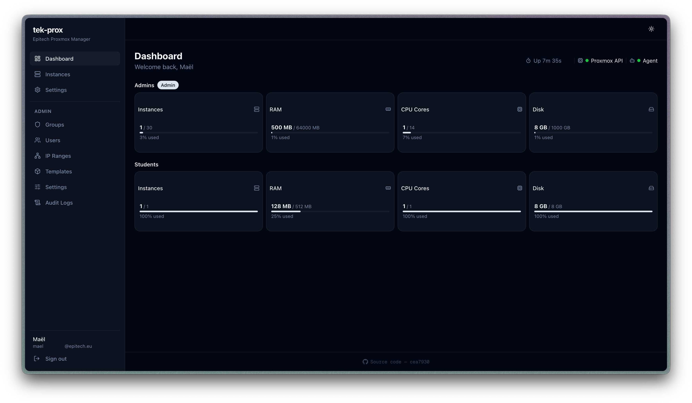
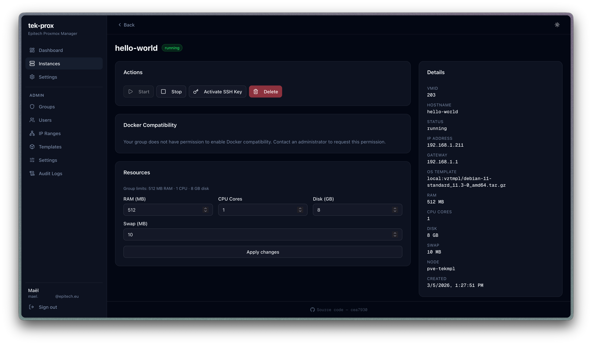
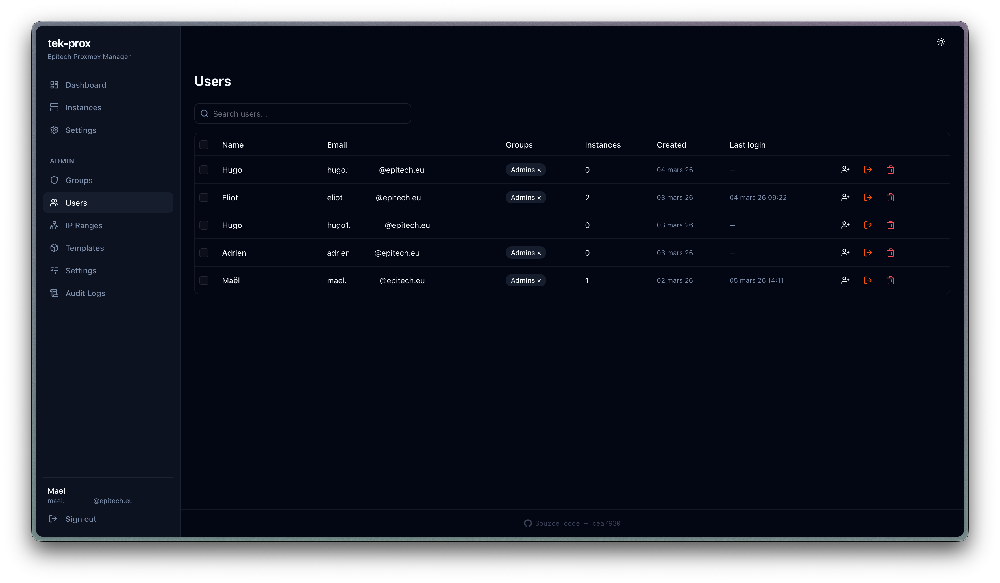
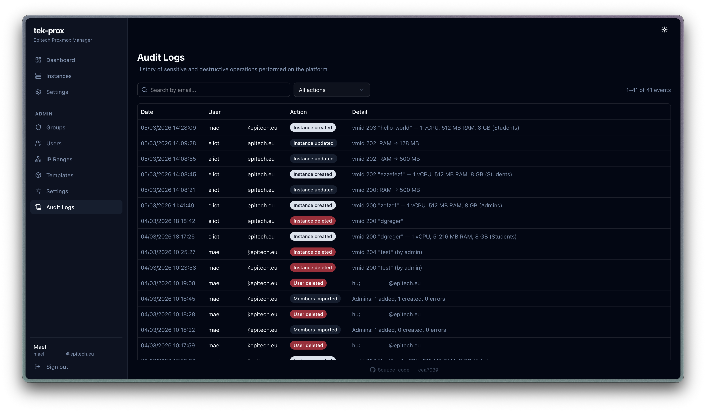

# tek-prox


**tek-prox** is a self-hosted web platform for managing Proxmox LXC containers. It lets students and teams provision, configure, and control their own Linux containers through a clean UI — without needing direct access to the Proxmox host.

---

## Screenshots


*Dashboard view — groups overview with per-group resource quotas (CPU, RAM, disk, instances)*


*Instance details — assigned resources, IP address, start/stop/reboot controls and Docker compatibility option*


*Admin panel — user management, group assignment and quota configuration*


*Audit logs — full history of sensitive actions (create, delete, start, stop, admin changes) to detect and investigate abuse*

---

## Key Features

### Container Management
- Create LXC containers with a guided form (OS template, CPU, RAM, disk, swap)
- Start, stop, reboot, and delete containers from the dashboard
- Edit container resources (CPU, RAM, disk, swap) after creation
- Real-time status display pulled directly from the Proxmox API

### SSH Key Injection
- Users store their SSH public key in their profile
- On container creation, the key is automatically injected into `/root/.ssh/authorized_keys` inside the LXC via the privileged agent

### Docker Compatibility
- Optional AppArmor `unconfined` profile applied to containers
- Allows running Docker inside LXC (nested containers)
- Configurable per group by admins

### IP Address Management
- Admins define IP ranges (CIDR ranges or individual addresses)
- IPs are atomically allocated at container creation and released on deletion
- Each container gets a static IP automatically assigned

### Group-Based Quotas
- Users belong to groups with configurable resource quotas:
  - Max instances, CPU cores, RAM, disk, swap
  - Docker compatibility toggle
- Admins can create, edit, and manage groups and memberships

### Admin Panel
- User management with group assignment and forced logout
- OS template management (add/remove available templates)
- IP range management (add/remove ranges)
- Global settings (storage pool, network bridge)
- Full audit log of all sensitive actions (create, delete, start, stop, admin changes…)
- Server status panel with Proxmox node uptime

### Authentication
- Microsoft OAuth (Azure AD) — restricted to a configured domain (e.g. `epitech.eu`)
- Session-based auth with NextAuth v4

---

## Architecture

```
Browser
  └── Next.js App (App Router, React 19)
        ├── API Routes  ──► Proxmox API (token auth)
        │                ──► SQLite via Prisma 7
        └── Agent client ──► proxmox-agent (Flask, runs as root on Proxmox host)
                               └── pct exec / LXC config file edits
```

The **proxmox-agent** is a small Python/Flask service that runs as root directly on the Proxmox host. It handles privileged operations that the Proxmox API cannot perform (AppArmor config edits, SSH key injection via `pct exec`). It authenticates requests via a shared API key (`X-Agent-Key` header).

---

## Getting Started (Development)

### Prerequisites

- Node.js 20+
- A running Proxmox VE host with API token access
- The `proxmox-agent` running on the Proxmox host (see below)

### 1. Clone and install dependencies

```bash
git clone https://github.com/mael-app/tek-prox.git
cd tek-prox
npm install
```

### 2. Configure environment variables

```bash
cp .env.example .env
```

Edit `.env` and fill in the required values:

| Variable | Description |
|---|---|
| `DATABASE_URL` | SQLite file path (e.g. `file:./dev.db`) |
| `NEXTAUTH_SECRET` | Random secret — generate with `openssl rand -base64 32` |
| `AZURE_AD_CLIENT_ID` | Azure App Registration client ID |
| `AZURE_AD_CLIENT_SECRET` | Azure App Registration client secret |
| `AZURE_AD_TENANT_ID` | Azure tenant ID |
| `RESTRICT_MICROSOFT_DOMAIN` | Domain to restrict login to (e.g. `epitech.eu`), or `false` |
| `PROXMOX_HOST` | Proxmox API URL (e.g. `https://192.168.1.100:8006`) |
| `PROXMOX_TOKEN_ID` | Proxmox API token ID (e.g. `user@pam!token-name`) |
| `PROXMOX_TOKEN_SECRET` | Proxmox API token secret |
| `PROXMOX_NODE` | Proxmox node name (e.g. `pve`) |
| `AGENT_BASE_URL` | URL of the proxmox-agent (e.g. `http://192.168.1.100:8765`) |
| `AGENT_API_KEY` | Shared secret for the proxmox-agent |
| `LXC_VMID_MIN` / `LXC_VMID_MAX` | VMID range to use for created containers |

### 3. Set up the database

```bash
npx prisma migrate dev
```

### 4. Start the development server

```bash
npm run dev
```

Open [http://localhost:3000](http://localhost:3000).

### 5. Create the first admin user

Log in once with your Microsoft account, then run:

```bash
npm run setup:admin
```

This will prompt for the user email and create an admin group.

---

## Setting up the Proxmox Agent

The agent runs on the Proxmox host itself and is required for SSH key injection and Docker compatibility features.

```bash
cd proxmox-agent

# Install dependencies
pip install flask

# Run the agent (as root)
AGENT_API_KEY=your-secret-key python agent.py
```

By default it listens on `127.0.0.1:8765`. Set `AGENT_HOST=0.0.0.0` to expose it on the network, and make sure to restrict access via firewall.

When running inside Docker on the Proxmox host, set `USE_NSENTER=true` (default) so the agent can reach Proxmox binaries via namespace entry.

---

## License

MIT
